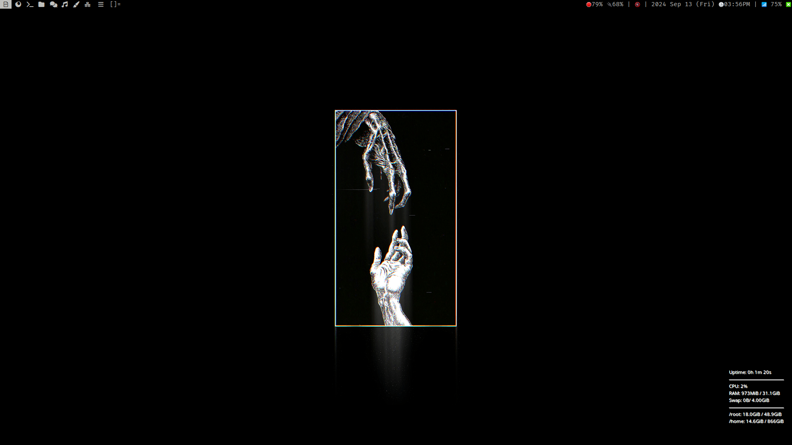
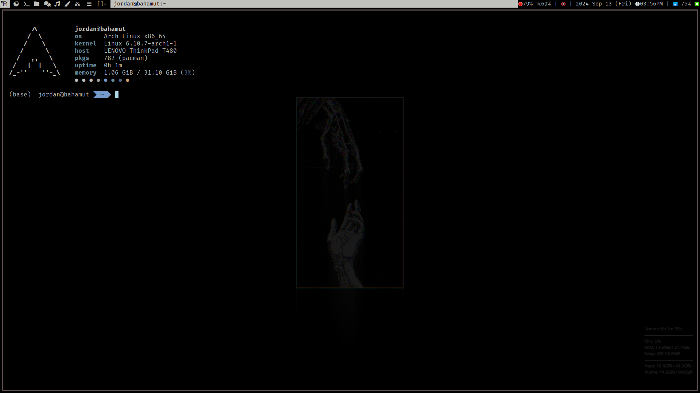

# Arch Linux Dotfiles

## Installation

script is in progress...

move Wallpapers to ~/Pictures/Wallpapers

move Scripts to ~/Documents/Scripts

move everything in config to ~/.config

move the hidden files in root to your root of home folder

## Desktop

